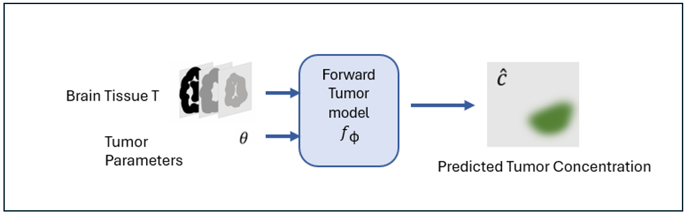
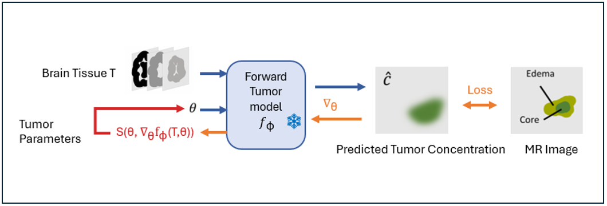
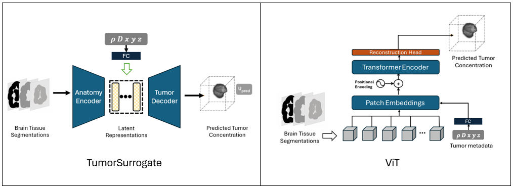

# TumorNetSolvers: A Deep Learning Framework for Personalized PDE-Based Tumor Growth Modeling

**TumorNetSolvers** is an adaptive deep learning framework designed for efficient personalization of PDE-based tumor growth models, focused on simulating and predicting tumor evolution. Built on the powerful nnU-Net framework, it leverages state-of-the-art neural architectures to address both **forward** and **inverse** tumor modeling problems.

---

### Table of Contents
1. [Overview](#overview)  
2. [Core Concepts](#core-concepts)  
3. [Model Architectures](#model-architectures)  
4. [Usage](#usage)  
5. [Installation](#installation)  
6. [Contributing](#contributing)  
7. [License](#license)  
8. [References](#references)  

---

## Overview

**TumorNetSolvers** provides a flexible and efficient solution for simulating tumor growth in 3D using **Partial Differential Equations (PDEs)**, specifically the Fisher-Kolmogorov equation. It personalizes the model for individual patients by inferring **tumor growth parameters** (diffusion coefficient, growth rate, initial location) from MRI scans or similar medical images.

---

### Forward Problem


- **Input**: A 3D medical image (e.g., brain tissue segmentations) and tumor parameters (growth rate, diffusion coefficient, tumor location).  
- **Output**: A 3D simulation of tumor corresponding to the given anatomy and tumor parameters.

---

### Inverse Problem


Given a high-performing differentiable forward model, we "freeze" the model and optimize its parameters based on a target tumor simulation.  
- **Input**: A target tumor simulation (e.g., MRI-based 3D tumor image).  
- **Goal**: Infer the underlying tumor parameters (e.g., growth rate, diffusion coefficient, tumor location) by adjusting these input parameters to match the target simulation.

---

## Core Concepts

### 1. PDE-Based Tumor Growth Modeling  
TumorNetSolvers is trained on the **Fisher-Kolmogorov equation** to model brain tumor cell dynamics over time and space:

   $$ 
   \frac{\partial c}{\partial t} = \nabla \cdot (D \nabla c) + \rho c(1 - c)
   $$

   Where:
   - \( c(x, t) \) is the tumor cell concentration,
   - \( D \) is the diffusion coefficient,
   - \( \rho \) is the growth rate,
   - \( \nabla \cdot (D \nabla c) \) is the diffusion term,
   - \( \rho c(1 - c) \) models logistic growth, limiting \( c \) as it approaches 1.


TumorNetSolvers uses deep learning to approximate this PDE's solutions but can, in theory, adapt to different PDE-based models.

---

### 2. Deep Learning Surrogate Models  
Neural networks approximate the PDE solution, mapping inputs (image + parameters) to outputs (simulation).

---

### 3. Built on nnU-Net  
The framework builds upon nnU-Net's self-configuring capabilities, adapting it for conditioned image-to-image regression tasks.

---

## Model Architectures



**TumorNetSolvers** includes three key models:  

1. **TumorSurrogate (Baseline)**  
   - A 3D CNN that integrates anatomy info and tumor metadata for conditioned tumor simulation.

2. **Modified nnU-Net**  
   - An adapted version of the powerful self-configuring nnU-Net framework for tumor growth simulation using conditioned inputs.

3. **3D Vision Transformer (ViT)**  
   - A transformer-based model incorporating tumor metadata as additional input tokens in the embedding space.

---

## Usage

For detailed usage, refer to the scripts in the [scripts directory](scripts/) or follow the instructions below:

1. **Forward Problem**  
   Run the script `running_inference.py` with the necessary inputs (3D medical image, tumor parameters) to generate tumor simulations.

2. **Inverse Problem**  
   Run the script `predict_tumor_params.py` to infer tumor parameters by optimizing against a target tumor simulation.

---

## Installation

To get started with **TumorNetSolvers**, install it directly from GitHub by following these steps:

1. Clone the repository:
    ```bash
    git clone https://github.com/ZeinebZH/tumornetsolvers.git
    cd tumornetsolvers
    ```

2. Install the required dependencies and the package:
    ```bash
    pip install -r requirements.txt
    pip install .
    ```

---

## Contributing

We welcome contributions to **TumorNetSolvers**!  

---

## License

This project is licensed under the MIT License and incorporates code from nnU-Net, licensed under Apache 2.0. Both licenses apply and must be respected. See the [LICENSE](LICENSE) file for details.

---

## References

1. **Weidner J, et al.** *Rapid Personalization of PDE-Based Tumor Growth Using a Differentiable Forward Model.* Medical Imaging with Deep Learning, 2024. [DOI](https://openreview.net/pdf?id=7SMswKSKIX)  
2. **Ezhov I, et al.** *Geometry-aware Neural Solver for Fast Bayesian Calibration of Brain Tumor Models.* IEEE Transactions on Medical Imaging, 2021;41(5):1269–78. [DOI](https://ieeexplore.ieee.org/abstract/document/9656125)  
3. **Isensee F, et al.** *nnU-Net: A Self-configuring Method for Deep Learning-based Biomedical Image Segmentation.* Nature Methods, 2021;18(2):203–11. [DOI](https://www.nature.com/articles/s41592-020-01008-z)  
4. **Lin K, Heckel R.** *Vision Transformers Enable Fast and Robust Accelerated MRI.* International Conference on Medical Imaging with Deep Learning, 2022. [DOI](https://proceedings.mlr.press/v172/lin22a.html)
