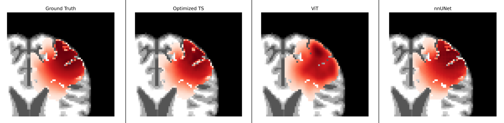
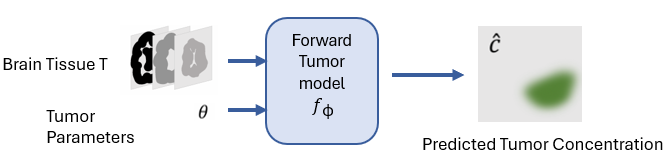
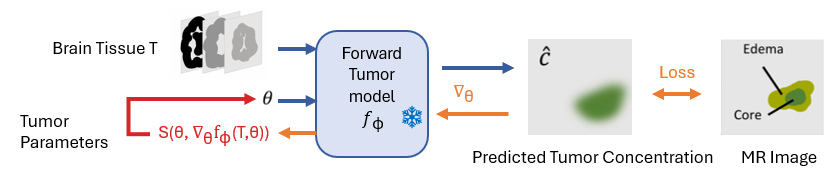
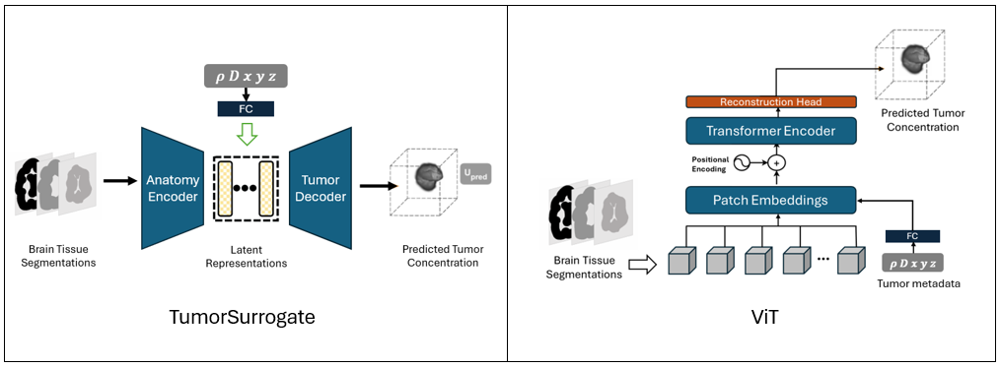
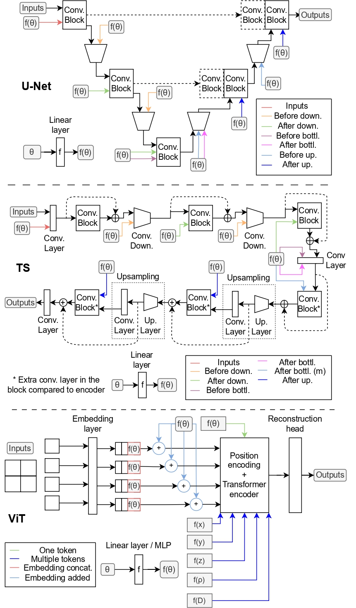

# TumorNetSolvers: A Deep Learning Framework for Personalized PDE-Based Tumor Growth Modeling


**TumorNetSolvers** is an adaptive deep learning framework designed for efficient personalization of PDE-based tumor growth models, focused on simulating and predicting tumor evolution. Built on the powerful nnU-Net framework, it leverages state-of-the-art neural architectures to address **forward** tumor modeling problems (**inverse** is currently under development).

The focus in this fork emphasizes the location where the coefficients of the PDEs are inserted and their influence on predictions.



---

### Table of Contents
1. [Overview](#overview)  
2. [Core Concepts](#core-concepts)  
3. [Model Architectures](#model-architectures)  
4. [Usage](#usage)  
5. [Installation](#installation)  
6. [Contributing](#contributing)  
7. [License](#license)  
8. [References](#references)  

---

## Overview

**TumorNetSolvers** provides a flexible and efficient solution for simulating tumor growth in 3D using **Partial Differential Equations (PDEs)**, specifically the Fisher-Kolmogorov equation. It personalizes the model for individual patients by inferring **tumor growth parameters** (diffusion coefficient, growth rate, initial location) from MRI scans or similar medical images.

---

### Forward Problem


- **Input**: A 3D medical image (e.g., brain tissue segmentations) and tumor parameters (growth rate, diffusion coefficient, tumor location).  
- **Output**: A 3D simulation of tumor corresponding to the given anatomy and tumor parameters.

<!-- Your comment here 
#---

%### Inverse Problem
%

%Given a high-performing differentiable forward model, we "freeze" the model and optimize its parameters based on a target tumor %simulation.  
%- **Input**: A target tumor simulation (e.g., MRI-based 3D tumor image).  
%- **Goal**: Infer the underlying tumor parameters (e.g., growth rate, diffusion coefficient, tumor location) by adjusting these %input parameters to match the target simulation.
-->
---

## Core Concepts

### 1. PDE-Based Tumor Growth Modeling  
TumorNetSolvers is trained on the **Fisher-Kolmogorov equation** to model brain tumor cell dynamics over time and space:

   $$ 
   \frac{\partial c}{\partial t} = \nabla \cdot (D \nabla c) + \rho c(1 - c)
   $$

   Where:
   - $$c(x, t)$$ is the tumor cell concentration,
   - $$D$$ is the diffusion coefficient,
   - $$\rho$$ is the growth rate,
   - $$\nabla \cdot (D \nabla c)$$ is the diffusion term,
   - $$\rho c(1 - c)$$ models logistic growth, limiting $$c$$ as it approaches 1.


TumorNetSolvers uses deep learning to approximate this PDE's solutions but can, in theory, adapt to different PDE-based models.

---

### 2. Deep Learning Surrogate Models  
Neural networks approximate the PDE solution, mapping inputs (image + parameters) to outputs (simulation).

---

### 3. Built on nnU-Net  
The framework builds upon nnU-Net's self-configuring capabilities, adapting it for conditioned image-to-image regression tasks.

---

## Model Architectures

<!--  -->

**TumorNetSolvers** includes three key models:  

1. **TumorSurrogate (Baseline)**  
   - A 3D CNN combined with residual connections that integrates anatomy info and tumor metadata for conditioned tumor simulation.

2. **Modified nnU-Net**  
   - An adapted version of the powerful self-configuring nnU-Net framework for tumor growth simulation using conditioned inputs.

3. **3D Vision Transformer (ViT)**  
   - A transformer-based model.

---

## Experiments locations



### 1. U-Net

- **Inputs** – Once, together with the input features, before any convolutional layer.  
- **Before downsampling** – Prior to every convolutional layer performing the downsampling step (`stride=2`).  
- **After downsampling** – Before every convolutional layer following a downsampling layer.  
- **Before bottleneck** – Once, before the first convolution layer representing the bottleneck.  
- **After bottleneck** – Once, after the last convolution layer in the bottleneck.  
- **Before upsampling** – Prior to every convolutional layer performing the upsampling step (`stride=2`).  
- **After upsampling** – Before every convolutional layer following an upsampling layer.  
- **After upsampling on skips** – Before every convolutional layer following an upsampling layer.  
  *(Used only for addition across all channels, including those concatenated from the encoder. Concatenation here would be equivalent to the normal after-upsampling case.)*

### 2. Tumor Surrogate

- **Inputs** – Once, together with the input features in the first layer, before any convolutional layer.  
- **Before downsampling** – Prior to each convolutional layer performing the downsampling step (`stride=2`) and after the skip connection has been considered.  
- **After downsampling** – After the skip connection has been retrieved and before the convolutional layer following each downsampling layer.  
- **Before bottleneck** – Once, after the skip connection and before the convolution layer representing the bottleneck.  
- **After bottleneck (original)** – Once, after the convolution layer corresponding to the bottleneck and before the skip connection is retrieved. This represents the original configuration.  
- **After bottleneck (modified)** – Once, after the skip connection and before the next convolutional layer of the bottleneck.  
- **After upsampling** – After the skip connection has been retrieved and after the convolution layer that is part of the upsampling stage. 

### 3. ViT

- **One token** – After patch generation, an extra token is added following a linear layer.  
- **Multiple tokens** – After patch generation, one token is added per coefficient involved.  
- **Embedding concatenated** – Coefficients are concatenated along the embedding dimension for all patches.  
  *(Since the embedding dimension is large, we concatenate 30 extra channels in total—6 per coefficient—to ensure sufficient influence.)*


## Usage

For detailed usage, refer to the scripts in the [scripts directory](scripts/) or follow the instructions below:

1. **Preprocessing of data**
   First, the data shall be preprocessed, to do so run the `preprocessing2.py` file with the corresponding settings.

2. **Training**
   Second, run the corresponding `training.py` with the necessary conditions desired upon training. 

3. **Forward Problem**  
   Run the script `running_inference.py` with the necessary inputs (3D medical image, tumor parameters) to generate tumor simulations.

4. **Evaluation of inference**  
   Run the script `eval.py` to generate the metric values based on inference as json files.

5. **Plotting**
   Run the script `post_analysis.py` to generate the plots for a deeper analysis on the results.

---

## Installation

To get started with **TumorNetSolvers**, install it directly from GitHub by following these steps:

1. Clone the repository:
    ```bash
    git clone https://github.com/yerayyMR/TumorNetSolvers.git
    cd tumornetsolvers
    ```

2. Install the required dependencies and the package:
    ```bash
    pip install -r requirements.txt
    pip install .
    ```

---

## Contributing

We welcome contributions to **TumorNetSolvers**! Please use this code for work based on the paper and not the original repository!

---

## License

This project is licensed under the MIT License and incorporates code from nnU-Net, licensed under Apache 2.0. Both licenses apply and must be respected. See the [LICENSE](LICENSE) file for details.

---

## References (to be updated)

1. **Weidner J, et al.** *Rapid Personalization of PDE-Based Tumor Growth Using a Differentiable Forward Model.* Medical Imaging with Deep Learning, 2024. [DOI](https://openreview.net/pdf?id=7SMswKSKIX)  
2. **Ezhov I, et al.** *Geometry-aware Neural Solver for Fast Bayesian Calibration of Brain Tumor Models.* IEEE Transactions on Medical Imaging, 2021;41(5):1269–78. [DOI](https://ieeexplore.ieee.org/abstract/document/9656125)  
3. **Isensee F, et al.** *nnU-Net: A Self-configuring Method for Deep Learning-based Biomedical Image Segmentation.* Nature Methods, 2021;18(2):203–11. [DOI](https://www.nature.com/articles/s41592-020-01008-z)  
4. **Lin K, Heckel R.** *Vision Transformers Enable Fast and Robust Accelerated MRI.* International Conference on Medical Imaging with Deep Learning, 2022. [DOI](https://proceedings.mlr.press/v172/lin22a.html)
